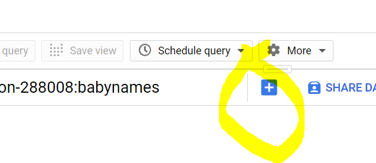

# Exploring a BigQuery Public Dataset


## Task 1. Query a public dataset

nav menu > bigquery > resources > ADD DATA > Explore public datasets. > searchbox > USA Names > VIEW dataset

in query editor 
* to  get the name and gender of the babies in this dataset, and then list the top 10 names in descending order 
```sql
SELECT
  name, 
  gender,
  SUM(number) AS total
FROM
  `bigquery-public-data.usa_names.usa_1910_2013`
GROUP BY
  name, gender
ORDER BY
  total DESC
LIMIT
  10
```


## Task 2. Create a custom table

* download [babynames](names.zip) to your computer
* unzip the file
* use  yob2014.txt  which is a csv

## Task 3. Create a dataset

nav menu > bigquery > [project ID] > CREATE DATASET

|property|value|data|
|:------|:------:|------:|
| Dataset ID|babynames|||
|Data location|US||

## Task 4. Load the data into a new table


nav menu > bigquery > [project ID] > babynames > CREATE TABLE( plus icon )



|property|value|data|
|:------|:------:|------:|
|Source > Create table from: > Upload|||
|Source > Select File|yob2014.txt||
|Source > File Format|CSV||
|Destination > Table name|names_2014||
|Schema > Edit as text|toggle on||
|Schema > text box|name:string,gender:string,count:integer||


## Task 5. Query the table

in query editor 
```sql
SELECT
 name, count
FROM
 `babynames.names_2014`
WHERE
 gender = 'M'
ORDER BY count DESC LIMIT 5
```


